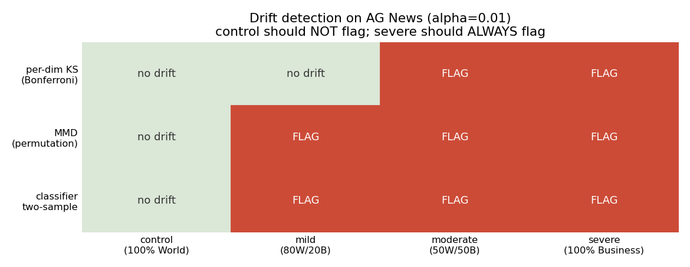
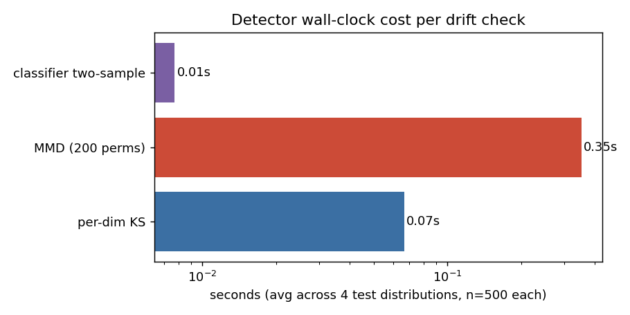

# Findings: which drift detectors actually work on text embeddings?

> Run on 2026-04-20, MacBook CPU. Reference n=500, each test n=500.
> Embedding model: [`all-MiniLM-L6-v2`](https://huggingface.co/sentence-transformers/all-MiniLM-L6-v2) (384-dim).

## Setup

I wanted to know how three commonly-recommended drift detectors actually
behave on a controlled, realistic scenario. I used [AG News](https://huggingface.co/datasets/ag_news)
because the topic categories are clean and well-separated, so I could
inject drift in known proportions and check which detectors catch it.

**Reference distribution:** 500 documents from the `World` category.

**Test distributions** (each n=500):

| Name | Composition | Expected behavior |
|---|---|---|
| `control` | 100% World | should NOT flag |
| `mild` | 80% World + 20% Business | should flag, but cheap detectors might miss |
| `moderate` | 50% World + 50% Business | should flag |
| `severe` | 100% Business | should flag, easy case |

**Detectors compared:**

1. **Per-dimension KS test with Bonferroni correction.** Run a Kolmogorov-
   Smirnov test on each of the 384 embedding dimensions independently,
   correct for multiple comparisons. The thing most monitoring tutorials
   reach for first.
2. **MMD with RBF kernel + permutation test.** Kernel two-sample test
   (Gretton et al., 2012). Standard "do these distributions differ"
   approach for high-dimensional data.
3. **Classifier two-sample test.** Train a logistic regression to
   distinguish reference samples from test samples; if it can do so
   above chance with statistical significance, the distributions differ
   (Lopez-Paz & Oquab, 2017).

All tested at α = 0.01.

## Results

### Detection table



| | control | mild (20% drift) | moderate (50% drift) | severe (100% drift) |
|---|---|---|---|---|
| per-dim KS (Bonferroni) | no drift | **no drift (MISS)** | FLAG (77/384 sig) | FLAG (198/384 sig) |
| MMD (200 perms) | no drift | FLAG (p<0.001) | FLAG | FLAG |
| classifier two-sample | no drift | FLAG (acc=0.548, p=0.001) | FLAG (acc=0.685) | FLAG (acc=0.983) |

### Wall-clock time per detection



| Detector | avg time per check |
|---|---|
| classifier two-sample | **0.01s** |
| per-dim KS | 0.07s |
| MMD with permutation | 0.35s |

### How detection scores scale with drift severity

| Drift level | per-dim KS sig dims | MMD² | classifier acc |
|---|---|---|---|
| control | 0 / 384 | -0.0004 (≈0) | 0.442 (≤ chance) |
| mild | 0 / 384 | 0.0022 | 0.548 |
| moderate | 77 / 384 | 0.0172 | 0.685 |
| severe | 198 / 384 | 0.0662 | 0.983 |

Both MMD² and classifier accuracy scale monotonically with drift
severity, which is what you want from a useful score.

## What I'm taking away

1. **Per-dim KS missed the mild-drift case entirely.** Even with 20%
   of the test distribution swapped to a different topic, no individual
   dimension's KS p-value cleared the Bonferroni threshold (α / 384).
   This is the expected behavior — Bonferroni is conservative and
   embedding dimensions aren't individually meaningful — but it means
   "use per-dim KS for monitoring" can give you false confidence on
   real production drift.

2. **The classifier two-sample test is both the most sensitive AND the
   fastest.** That's not what I expected going in. On 500-vs-500
   384-dim embeddings, a 5-fold logistic regression CV runs in ~10ms;
   the MMD permutation test runs in ~350ms because of the kernel
   matrix. For a monitoring system that runs continuously, this is
   the better default.

3. **MMD's score is the most informative under the alarm**, even if
   the classifier fires first. MMD² grows ~30x from mild to severe
   drift (0.002 → 0.066), giving you a usable severity signal that's
   directly comparable across runs. Classifier accuracy is bounded
   by the task's separability (the easier the categories, the
   higher the ceiling), so its absolute value is less interpretable
   across deployments.

4. **None of these three detectors had a false positive on the
   control distribution.** That was the table-stakes check — a
   detector that flags `World vs more World` would be useless. All
   three pass it cleanly.

## Limitations to be honest about

- **AG News categories are very clean.** Real production drift is
  usually subtler — distribution shift inside a single semantic region,
  not an obvious topic swap. Mild drift in this experiment is still
  a genuine topic mixture; sub-topic drift would be a harder test.
- **n=500 reference / n=500 test is generous.** In practice you often
  have to detect drift on much smaller batches. Per-dim KS in
  particular suffers more at small n (its lack of cross-dimension
  signal becomes worse).
- **I used a single embedding model.** Different embedding spaces have
  different statistical structure, and the relative ranking of
  detectors might differ. I'd want to repeat this on at least one
  larger model (e.g., `intfloat/e5-large-v2`) before generalizing.
- **The classifier two-sample test depends on the classifier choice.**
  Logistic regression is a reasonable default but a stronger model
  (gradient-boosted trees, small MLP) would catch finer drift at
  the cost of more compute and, more importantly, more risk of
  flagging *uninteresting* drift.

## What I'd do next

- **Replace `src/analysis/statistical_tests.py` per-dim KS with the
  classifier two-sample test as the primary detector**, and keep
  MMD as the secondary "is this serious?" signal. Drop or de-emphasize
  per-dim KS — it gives false confidence on the case (mild drift)
  where you actually need help.
- Add a **retrieval-quality canary** alongside the distributional
  checks: a fixed set of (query, expected-doc) pairs scored
  continuously. Distributional drift becomes the *explanatory*
  metric for canary regressions, not the primary alarm.
- Repeat this experiment with **per-cluster drift** — drift that only
  affects one semantic region of the embedding space. That's the
  case I'd most worry about in production and the one this
  experiment doesn't currently cover.
- Try **drift detection on activations from an SAE** trained on the
  embedding space, in the spirit of [Anthropic's interpretability
  work](https://transformer-circuits.pub/2024/scaling-monosemanticity/) —
  whether feature-level drift is more interpretable than raw
  embedding-level drift is genuinely an open question to me.

## Reproducibility

```bash
python -m venv .venv && source .venv/bin/activate
pip install sentence-transformers scikit-learn matplotlib datasets scipy

python experiments/01_drift_detector_comparison/run_experiment.py
```

Random seed: `42`. The MMD permutation test is the only stochastic
component (200 permutations). Other methods are fully deterministic
on a given machine.

## References

- Lopez-Paz & Oquab, [*Revisiting Classifier Two-Sample Tests*](https://arxiv.org/abs/1610.06545) (ICLR 2017)
- Gretton et al., [*A Kernel Two-Sample Test*](https://jmlr.org/papers/v13/gretton12a.html) (JMLR 2012)
- Rabanser et al., [*Failing Loudly: An Empirical Study of Methods for Detecting Dataset Shift*](https://arxiv.org/abs/1810.11953) (NeurIPS 2019) — the inspiration for this comparison setup
